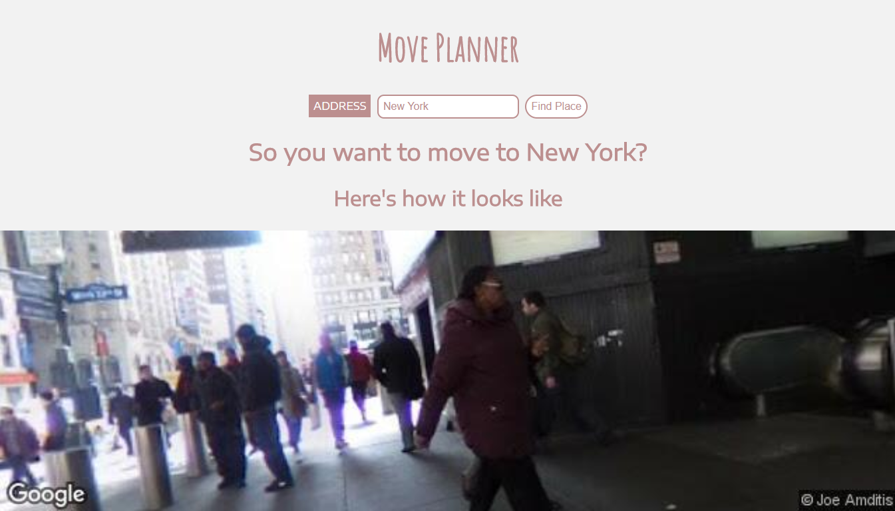

<h1 align="center">Move Planner</h1>
<h3 align="center">Instantly Find Your Next Destination</h3>

Insanely simple to use, yet powerful tool to find and decide your next destination stop.

## Detail
Move Planner provides an engaging and immersive way to search a destination for your next trip or your permanent next residence. Just search for a destination and you'll get the photo of that location, Wikipedia articles to know your next destination well and also New York Times article about your next stop, all at just one one click.

## Demo
This is how it looks like:

## Usage
You can use Move Planner by clicking [here](https://shahzaibkhalid.github.io/move-planner/)

# License
Move Planner is licensed under the [MIT License](https://github.com/shahzaibkhalid/move-planner/blob/master/LICENSE.txt).

Copyright (c) 2017 Shahzaib Khalid